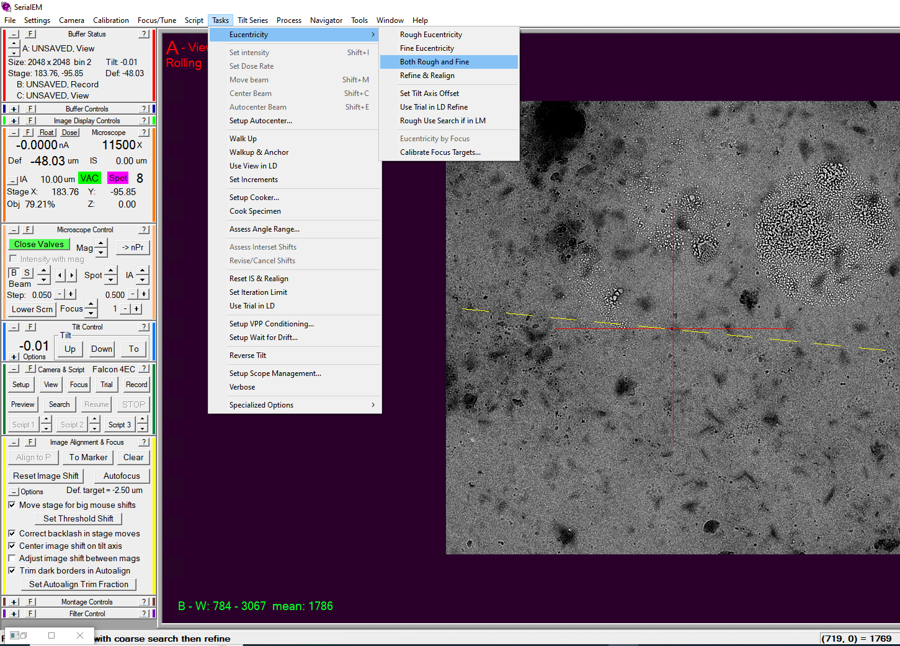
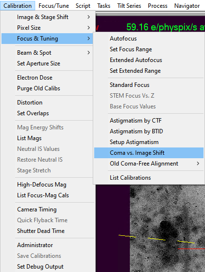
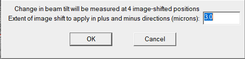
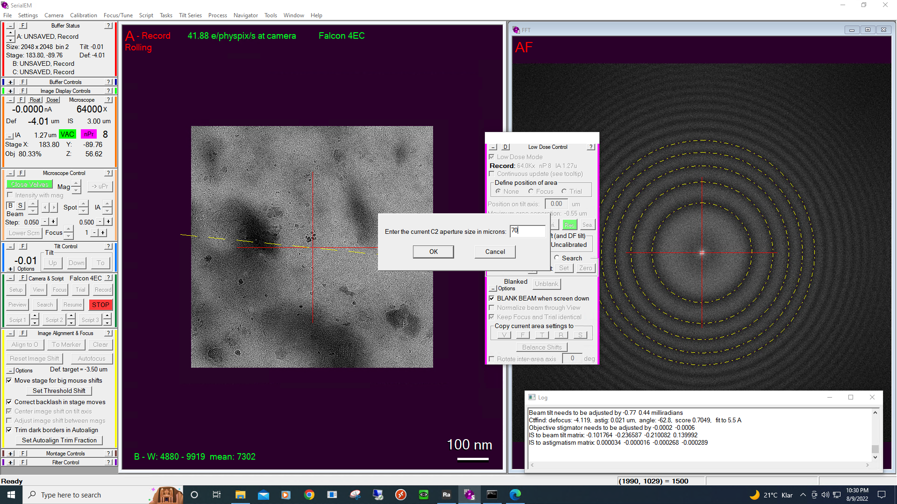

Getting Started
===============

Here we outline how to setup SerialEM for multishot acquisition. 
Please cosult your Microscope Manager before you follow these steps.

We want to achieve following goals: 
- Tune Astigmatism and Coma
- Calibrate Coma vs Image shift
But first, make sure you go through follwing preparation steps.

Preparations
------------------

Find a spot on the grid with sufficiently large carbon area. 
I prefer to use a continuous carbon or R1/4 grid for this specific purpose.

Make sure you are in low dose mode and the scope is setup for acquisition.
At this point it is also important to make sure there is no Image shift between Record and View settings. 
Once everything is setup, make sure that the sample is in euccentric height (run euccentric both) and run autofocus routine. 

    Fig 1. Setting Euccentric height both.

In the end, make sure that the objective aperture is retracted. 

Tune Astigmatism and Coma
------------------

Enable live FFT under :semmenu:`Process` > :semmenusel:`Live FFT`. Select :semmenu:`Process` > :semmenusel:`FFT`.
Make sure :semmenu:`Record` and :semmenu:`Trial` parameters give sufficient number of Thon rings. 

Click on :semmenu:`Focus/Tune` > :semmenusel:`Correct Astigmatism by CTF`.

Next, click on :semmenu:`Focus/Tune` > :semmenusel:`Coma-free alignment by CTF`.

I would recommend using the script from `Wim Hagen <https://serialemscripts.nexperion.net/script/47>`_.

Calibrate Coma vs Image shift
------------------

Please consult with your Microscope manager before continuing with this step. 

Under :semmenu:`Calibration` > :semmenu:`Focus & Tuning` menu, you will find :semmenu:`Coma vs. Image Shift`. 

    Fig 2. Starting Coma vs. Image shift Calibration

Once you click on it, You would be promted to input ampunt of maximum image shift (IS). 
You will have to make sure apriori that there is carbon (or any other feature that results in sufficientl number of thon rings) in the field of View (FOV) when such large IS is applied. 

    Fig 3. Setting maximum image shift for Coma vs. Image Shift Calibration

If the calibration is succesful, you would be prompted to input current C2 aperture value. 

    Fig 4. Setting C2 Aperture size after successful completion of Coma vs. Image shift calibration.

At this step, if you used a calibration grid, load the grid you want to acquire tilt series on and find a sport with some carbon or area which results in sufficient number of Thon rings. 

Continue by making sure the sample area is in euccentric height. 
Insert and centre the Objective aperture. 
Rerun :semmenu:`Focus/Tune` > :semmenusel:`Correct Astigmatism by CTF`.

You are now all set to acquire Multishot tilt series!