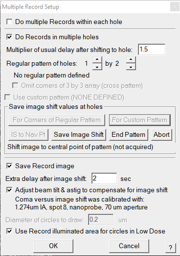

Multishot Tomography using SerialEM script commands (old)
==========

Following workflow describes Multishot data acquisition as depicted in Fig. 3 of `Multishot Tomography preprint <https://www.biorxiv.org/content/10.1101/2022.04.10.487763v1>`_

.. figure:: images/manu_fig_3.png
    :width: 600

    Fig 1. Multishot tilt series acquisition provides high throughput way to sub-nanometer *in situ* subtomogram average from FIB-milled lamellae. 

We want to achieve following goals: 

- Setup custom pattern for Multishot acquisition.
- Modify SerialEM dose-symmetric acquisition script for Multishot acquisition.  

Setting up custom Multishot pattern
--------------
 
 We will use `Multiple Record setup dialog <https://bio3d.colorado.edu/SerialEM/betaHlp/html/hidd_multi_shot_setup.htm>`_.
 Please familiarize yourself with available options. 

Open the dialog using :semmenu:`Navigator` > :semmenu:`Montaging & Grids` > :semmenusel:`Set Multi-shot parameters`. 

    Fig 2. Multiple Record setup dilog in SerialEM

If you don't have any saved custom pattern, :semmenu:`Use custom pattern` will be grey and show (NONE DEFINED).

First, we will setup a custom pattern to acquire three-shot (3X multishot) tilt series as depicted in Fig 1. 
For this purpose, one has to calculate Image shift for each shot as shown in Fig 3. 

.. figure:: images/imageshifts_fig1.png
    :width: 400

    Fig 3. Image shifts for 3x Multishot acquisition. 

To start, make sure your is Low dose mode :sembutton:`Record [Rec]`. 
Open a blank script using :semmenu:`Script` and type following script command.

::

    ImageShiftByMicrons 0 0

Click on :semmenu:`For Custom Pattern` under section :semmenu:`Save image shift values at holes`

    Fig 4. Setting up custom pattern

It will promt to **Shift to first acquire position in the pattern**. 
In this case the first acquire position is without any Image shift. 
Hence, we will continue by clicking :semmenu:`Save Iamge Shift`. 

For the second shot we will have to Image shift by 1.2 µ. 
Edit the script to Image shift by 1.2 microns and execute using :semmenu:`Run`.

::

    ImageShiftByMicrons 1.2 0

Continue by clicking :semmenu:`Save Iamge Shift` to save image shift for second shot. 

For the third shot we will have to Image shift by -2.4 µ with respect to second shot.  
Edit the script to Image shift by -2.4 microns and execute using :semmenu:`Run`.

::
    
    ImageShiftByMicrons -2.4 0

Continue by clicking :semmenu:`Save Iamge Shift` to save image shift for second shot. 
Click on :semmenu:`End Pattern`. 

You can always :semmenu:`Abort`, and start again. 

Once the custom patter is saved you should be able to select checkbox for :semmenu:`Use custom pattern`.

Finally, Check following boxes:

- :semmenu:`Save Record image`
- :semmenu:`Adjust beam tilt & astig to compensate for image shift`
- :semmenu:`Use Record illuminated area for circles in Low Dose`

In the :semmenu:`Navigator` menu, select :semmenu:`Montaging & Grids` > :semmenu:`Show Shots when Show Acquire`.
you should be able to see the the custom pattern when you move the Navigator marker. 

    Fig 5. Multiple records shown for marker position.

Multishot acquisition script
--------------